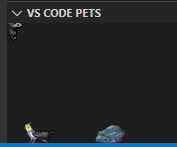

# Shera's User Page

**I am so sleepy**

> hello TA that is reading this 

## Sections:
1. [README](README.md)
2. [Me as a person:](#Me-as-a-person:)
3. [Me as a programmer:](#Me-as-a-programmer:)

## Me as a programmer:

* my favorite language is python
* I started programming in C in sophomore year of high school and I forgot it all
* Here are my **VSCode** pets 
  * 
* here is [my github](https://github.com/idonotknowwhatiamdoing) (it is a bit empty) 
* I should probably do more leetcode

> Here is my favorite leetcode tech to score bottom 1% in runtime
```
while (something){
    while (something){
        while (something){
        .
        .
        .
        }
    }
}
```

## Me as a person:

* I CAD stuff for fun


* I draw sometimes
* 
* Here is my bucket list for this quarter:
- [ ] survive
- [ ] sleep at least 8 hours every night
- [x] attend every class at least once